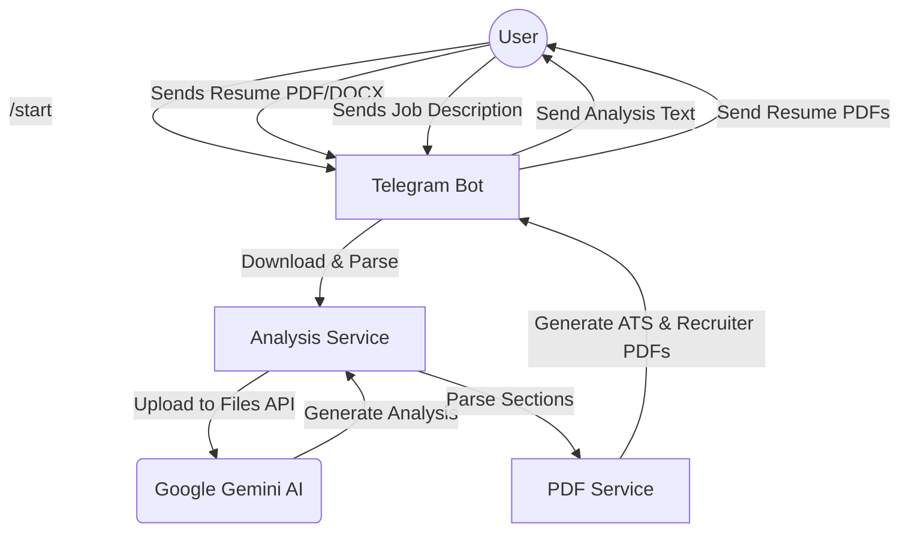

# Resume Analyzer Telegram Bot 🤖

A powerful Telegram bot that analyzes resumes against job descriptions using Google Gemini AI and provides professional feedback along with tailored resume versions.

## 🌟 Features

- **Multi-Format Support**: Analyzes both PDF and DOCX resumes.
- **Deep AI Analysis**: Get match scores, missing skills, and detailed improvements.
- **Professional Resume Generation**: Automatically generates **ATS-Optimized** and **Recruiter-Friendly** resumes in PDF format.
- **Structured Feedback**: Organized, easy-to-read sections sent directly to your Telegram chat.

---

## 🏗️ Workflow Diagram



---

## 🛠️ Setup Guide

### 1. Telegram Bot Token
1. Open Telegram and search for **@BotFather**.
2. Send `/newbot` and follow the instructions to name your bot.
3. You will receive an **API Token**. Save this; it's your `TELEGRAM_BOT_TOKEN`.

### 2. Google Gemini API Key
1. Visit the [Google AI Studio](https://aistudio.google.com/).
2. Click on **"Get API key"** in the sidebar.
3. Create a new API key in a new project.
4. Save this key; it's your `GEMINI_API_KEY`.

---

## 🚀 Installation & Running

1. **Clone the repository**:
   ```bash
   git clone <repository-url>
   cd TelegramBot/backend
   ```

2. **Install dependencies**:
   ```bash
   npm install
   ```

3. **Configure Environment**:
   - Create a `.env` file in the `backend` directory.
   - Add your tokens:
     ```env
     TELEGRAM_BOT_TOKEN=your_telegram_token_here
     GEMINI_API_KEY=your_gemini_api_key_here
     PORT=3000
     ```

4. **Start the Bot**:
   ```bash
   npm start
   ```

---

## 📂 Project Structure

- `bot/telegram.js`: Handles Telegram interactions and message logic.
- `services/aiService.js`: Interface for Google GenAI (Gemini).
- `services/analysisService.js`: Core logic for parsing and orchestrating the analysis.
- `services/pdfService.js`: Generates professional PDF resumes using `pdfkit`.
- `services/parserService.js`: Text extraction fallback for documents.
- `utils/fileDownloader.js`: Downloads files from Telegram servers.

---

## 📝 License
This project is for educational purposes. Feel free to modify and use it!
